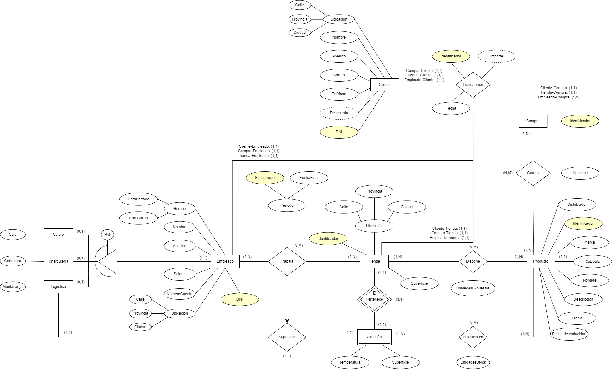
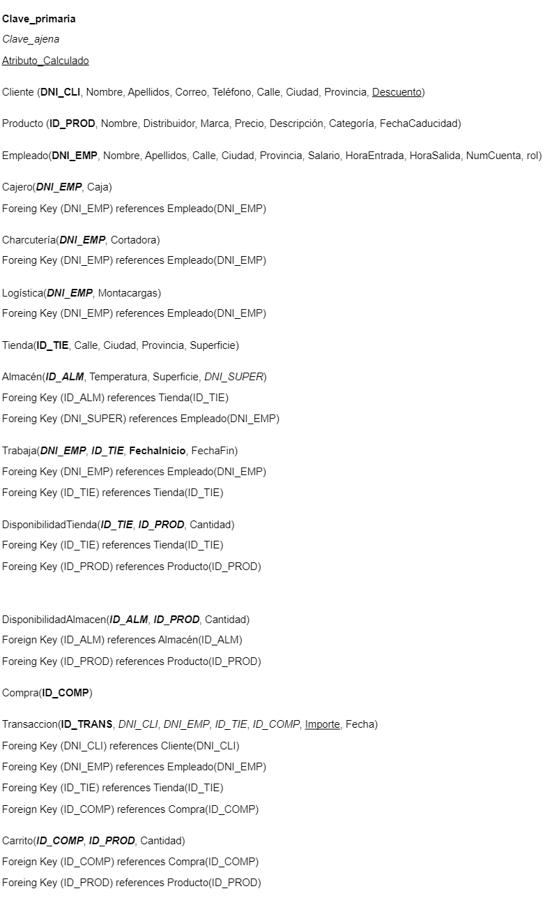

# Proyecto ADBD (Supermercado)

## Integrantes

- Airam Rafael Luque León (alu0101335148@ull.edu.es)

- Andrés Pérez Castellano (alu0101313511@ull.edu.es)

## Objetivos

- Almacenar la información de los productos disponibles en la tienda.

- Almacenar la información del personal designado contratado.

- Contemplar las diferentes categorías de productos de la empresa.

- Contemplar los diferentes roles de los empleados, pudiendo almacenar la 
  información correspondientes de estos, como el cargo, la información 
  personal, horario, etc.

- La base de datos deberá almacenar la información correspondiente a los 
  clientes.

- Almacenar información de interés extraída de las transacciones realizadas.

- Actualización automática del stock de las tiendas, tras realizar una compra.

- Aplicación automática de descuentos a ciertos clientes.

- Tener un sistema preventor de inserción de consultas erróneas (precios negativos, saldos por debajo del salario mínimo, etc).

- Desarrollar una interfaz de comunicación tipo REST API, que facilite tanto a 
  los usuarios finales, como a otras aplicaciones y servicios internos de la 
  empresa el acceso a la información disponible en la base de datos.

## Supuesto teórico

Se desea desarrollar una base de datos para una empresa que tiene diferentes 
supermercados. Esta base de datos ha de almacenar la información necesaria para
llevar un control de los productos que hay en cada una de las tiendas, de las 
cuales conocemos su identificador, dirección y superficie. 

Debemos almacenar de cada producto información de interés como el identificador
del producto, el nombre, el distribuidor, la marca, el precio, la descripcción,
la categoría ('Alimentacion', 'Limpieza', 'Higiene', 'Textil', 'Herramientas' y
'Otros') y la fecha de caducidad para algunos de ellos.

De igual manera se quiere llevar un control de la contratación de los empleados, 
guardando su información personal (DNI, nombre, apellidos, dirección, salario, 
horario de entrada y salida, número de cuenta y rol dentro de la tienda (Cajero, 
Charcuteria, Logistica, Gerente, Pescaderia, Carniceria), periodo y destinación.
Cabe resaltar que el rol nos servirá para mantener almacenado información de 
algunos puestos específicos, como las herramientas que usen, para poder llevar 
un control de las herramientas asignadas a cada uno, como puede ser a los 
encargados del almacén los montacargas de cada uno.

Cabe resaltar que cada tienda tiene un único almacen, y deberemos poder 
almacenar la información de la superficie, la temperatura y el empleado que se 
encarga de este. También tendremos que guardar el identificador de la tienda a 
la que pertenece cada almacén y el stock de cada producto en cada  almacén, así 
como tambíen queremos saber la cantidad de cada producto en exposición.

La empresa desea implementar un sistema de fidelización de clientes, por lo que
queremos almacenar la información de los clientes, siendo esta DNI, nombre, 
apellido, correo, teléfono, dirección y un descuento que se le aplica a los 
clientes que realicen compras superiores a 100€ mensuales.

Por último, la empresa quiere llevar un control de las transacciones que se 
realizan en cada una de las tiendas, almacenando el identificador del cliente 
que la ha realizado, el cajero que ha  gestionado la compra, los productos 
comprados, el importe total, un identificador de la compra y la fecha de la 
misma. Todo esto servirá a su vez para aplicar el sistema de descuento a los 
clientes que en caso de que realizen compras de más de 100 euros mensuales, se 
les aplicará un descuento de 10€ en su próxima compra superior a 50€.

## Modelo entidad-relación



De cara a las decisiones fundamentales de nuestro diseño las vamos a dividir en 
diferentes secciones: la gestion de los empleados, la gestion de los productos, 
y la la gestion de los clientes y las transacciones.

### Gestión de empleados


Como se nos estipula en el supuesto teórico, vamos a tener que almacenar cierta 
información de los empleados, de ahí que creemos dicha entidad, no obstante 
como se nos menciona que dependiendo del rol de estos, se almacenará la 
herramienta que tengan asignada, que no siempre existirá, se optó por hacer una 
implementación jerárquica de herencia, guardando en diferentes tablas simplemente
dicha información.

Otro aspecto importante es la utilización de una relación de exclusividad entre
supervisa y trabaja, puesto que un supervisor de un almacén debe de haber
trabajado al menos en una ocasión en dicha tienda.

Por otro lado también vamos a tener que guardar un registro de las 
destinaciones de cada empleado y como debemos tener una entidad tienda para 
almacenar la información de interés de cada una de las tiendas de forma 
independiente, simplemente los relacionamos mediante una relación de trabaja, 
que derivará posteriormente en una tabla.

Finalmente se optó por una relación de supervisión entre los almacenes 
(específicos de cada tienda en una relación de 1 a 1), con los empleados de 
logística, debido a que necesitamos que los almacenes tengan un supervisor.

### Gestión de stock


Para la gestión de los productos en cada tienda, partimos de 3 entidades 
básicas, la tienda, el producto, y el almacén. Estas entidades optamos por 
unirlas con relaciones de "dispone" y "producto en", de esta forma 
almacenaremos el stock expuesto en tienda y el stock en el almacén para cada
una de los supermercados.

Cabe resaltar que almacén es una entidad débil, debido a que cada almacén está
ligado a una tienda en una relación 1 a 1 de pertenencia, por lo que si 
desaparece la tienda debería desaparecer el almacén.

### Gestión de clientes y transacciones


Con respecto a los clientes, éstos se representan como una entidad propia y se
recogen diversos atributos. Los clientes pueden recibir descuentos en función
de su volumen de gasto mensual, por ello dicho atributo debe ser calculado
posteriormente.

Como se ha comentado al inicio, las transacciones realizadas en las tiendas son
un aspecto central del negocio y de nuestro diseño. Éstas se representan como una
relación múltiple, que asocia 4 entidades fundamentales:
- Cliente, cardinalidad N. Es el cliente que realiza la compra.
- Empleado (puesto de caja), cardinalidad N. Atiende al cliente.
- Tienda, cardinalidad N. Lugar dónde se realiza la compra.
- Compra, cardinalidad 1. Representa los productos comprados.

Cabe destacar que el importe monetario total, se calcula automáticamente en base
al contenido del carrito y los precios de los productos.

Por tanto, cada transacción debe hacer referencia a un conjunto de productos
(las compras individuales suelen ser poco comunes), esto es posible gracias
a una entidad auxiliar llamada `Compra`, de lo contrario, no podríamos hacer
referencia a la entidad `Carrito` a través de una clave ajena, pues el atributo
referenciado debe ser una clave primaria (por tanto única) en la otra entidad.

Finalmente, la entidad `Carrito`, contiene los (posiblemente múltiples) productos
de una compra, así como las cantidades adquiridas para cada uno. Es necesario
relacionarse con la entidad `Producto`, para poder obtener su precio.

## Modelo relacional



### Triggers

- Revisar que el supervisor del almacén sea un empleado de logística y ya haya 
  trabajado en la tienda con anterioridad 
  
- Calcular automáticamente el importe de una transacción, con respecto al
  carrito

- Revisar que al intentar comprar un producto, esté en la tienda y haya 
  suficiente

- Revisar que el empleado a cargo de la transacción sea un cajero y trabaje en 
  esa tienda

- Acrtualizar el stock disponible de una tienda depués de una compra


## Grafo relacional


## Restricciones semánticas

- Tanto el precio de un producto, la cantidad de producto disponible, la 
  superficie de un edificio, como el importe de una transacción deben ser 
  positivos.

- El descuento de un cliente se ubica en el intervalo 0 y 25€

- El identificador de una máquina no puede ser negativo.

- La fecha de finalización debe ser posterior a la facha de inicio en un 
  periodo laboral.

- El salario mínimo en la compañía es 900€.

- Sólo puede haber un almacén por cada tienda.

- Un empleado de logística puede supervisar un almacén, siempre y cuando haya 
  trabajado en esa tienda alguna vez.

- El descuento de 10€ se aplica para clientes cuyo gasto total supere 100€, en 
  este último mes.

- El importe de una transacción, se calcula en base al precio y la cantidad de 
  los productos de la cesta.

- Todos los productos de una compra, deben estar disponibles en la tienda con 
  suficiente cantidad.

- En una transacción, no se puede comprar un producto que no esté en esa tienda.

- En una transacción, debe atendernos un empleado de caja, que trabaje en dicha 
  tienda.


## Consultas de prueba

Valor total de los productos almacenados por cada tienda.
```sql
SELECT ID_TIE, SUM(Cantidad * Precio) AS valor
FROM DisponibilidadTienda JOIN Producto USING (ID_PROD)
GROUP BY ID_TIE
ORDER BY valor DESC;
```

```
 id_tie |       valor        
--------+--------------------
 T001   |  4849.429999999999
 T002   | 1549.9199999999998
 T003   |             427.74
 T008   | 419.90999999999997
 T010   |             239.92
 T006   |             224.91
 T005   |              89.99
 T004   |              79.93
 T007   |              49.95
 T009   |  45.93000000000001
(10 rows)
```

Añadimos 2 unidades del producto 4 y 1 unidad del producto 2 a la tienda "T001".
```sql
INSERT INTO DisponibilidadTienda VALUES
('T001', 4, 2),
('T001', 2, 1);
```

Hacemos una compra (productos 2 y 4) superior a 100€.
```
 id_prod | precio 
---------+--------
       2 |  24.99
       4 |  89.99
(2 rows)
```

```sql
INSERT INTO Compra VALUES (2000);

INSERT INTO Carrito VALUES
(2000, 4, 1),
(2000, 2, 1);
```

```
 id_comp | id_prod | cantidad 
---------+---------+----------
    2000 |       4 |        1
    2000 |       2 |        1
(2 rows)
```

```sql
INSERT INTO Transaccion
VALUES (DEFAULT, '12345678A', '87654321A', 'T001', 2000);
```

```
 id_trans |  dni_cli  |  dni_emp  | id_tie | id_comp |      importe       |           fecha            
----------+-----------+-----------+--------+---------+--------------------+----------------------------
       29 | 12345678A | 87654321A | T001   |    2000 | 114.97999999999999 | 2023-01-10 19:10:22.245297
(1 row)
```

El cliente ya dispone de un descuento de 10€.
```sql
SELECT Descuento FROM Cliente WHERE DNI_CLI = '12345678A';
```

```
 descuento 
-----------
        10
(1 row)
```

Veamos si en la siguiente compra se aplica el descuento.
```sql
INSERT INTO Compra VALUES (3030);

INSERT INTO Carrito VALUES (3030, 4, 1);

INSERT INTO Transaccion
VALUES (5050, '12345678A', '87654321A', 'T001', 3030);

SELECT Importe FROM Transaccion WHERE ID_TRANS = 5050;
```

```
 importe 
---------
   79.99
(1 row)
```

Por otra parte, disponemos de un script para comprobar el correcto funcionamiento
de algunos disparadores. Probamos con algunos casos erróneos.

```sql
-- Consultas que revisan el correcto funcionamiento de los triggers, las restricciones


-- Cambiar el supervisor de la tienda T001.
-- Se espera un error, el empleado nunca ha trabajado allí.
UPDATE Almacen
SET DNI_SUPER = '87654321J'
WHERE ID_ALM = 'T001';

-- check_cajero: 
INSERT INTO Compra VALUES 
(5000),
(5001),
(5002);

INSERT INTO Carrito VALUES
(5000, 1, 3),
(5000, 2, 2),
(5001, 3, 1),
(5002, 4, 2),
(5002, 1, 1000);

-- trabaja en T001, pero no es cajero -> error 
INSERT INTO Transaccion VALUES 
(DEFAULT, '12345678A', '87654321E', 'T001', 5000);

-- cajero de otra tienda -> error
INSERT INTO Transaccion VALUES
(DEFAULT, '12345678A', '87654321A', 'T002', 5001);


-- check producto:
-- producto inexistente en una tienda o con stock insuficiente -> error
INSERT INTO Transaccion VALUES
(DEFAULT, '12345678A', '87654321A', 'T001', 5002);
```

```
supermercado=# \i check.sql 
psql:check.sql:8: ERROR:  El empleado 87654321J no ha trabajado nunca en la tienda T001
CONTEXT:  PL/pgSQL function check_supervisa() line 8 at RAISE
psql:check.sql:25: ERROR:  El empleado 87654321E no es cajero en la tienda T001
CONTEXT:  PL/pgSQL function check_cajero() line 7 at RAISE
psql:check.sql:29: ERROR:  El empleado 87654321A no es cajero en la tienda T002
CONTEXT:  PL/pgSQL function check_cajero() line 7 at RAISE
psql:check.sql:35: ERROR:  No hay stock suficiente de alguno de los productos de la compra 5002
CONTEXT:  PL/pgSQL function check_producto() line 12 at RAISE
```

## REST API

Para diseñar el REST API, hemos optado por el framework [FastAPI](https://fastapi.tiangolo.com/)
para *Python*. Ofrece una serie de ventajas, entre ellas:

- Anotaciones de tipos para: clases, variables, parámetros y retorno de funciones, etc.
- Gracias a lo anterior: validación automática del cuerpo de la petición.
- Conversión de las respuestas a formato *json*.
- Generación de documentación interactiva.

Para instalar las dependencias en un entorno virtual, podemos ejecutar los siguientes
comandos:
```bash
cd ProyectoADBD/

python -m venv venv

source ./venv/bin/activate

pip install -r requirements.txt
```

Pruebe a usar `python3` si obtiene algún error. Este proyecto ha sido desarrollado
con Python `3.8`, en un entorno *Linux*.

Coloque las credenciales de su base de datos en un fichero *.env*, ubicado en la
raíz del proyecto. Por ejemplo:

```bash
DB_NAME="supermercado"
DB_USER="usuario"
DB_PASSWORD="clave"
```

Para ejecutar el servidor, utilice la siguiente orden. Si ha seguido los pasos,
debería estar ubicado en la raíz del proyecto. Puede cambiar el *host* y el puerto
por defecto, si así lo desea.

```bash
uvicorn api.main:app

# If you want to specify host address and port number.
uvicorn api.main:app --host 127.0.0.1 --port 8000
```

Visite la documentación interactiva en http://127.0.0.1:8000/docs para conocer
más sobre las funcionalidades ofrecidas. Puede probar las distintas operaciones
**CRUD**, categorizadas por el método *http* (*GET*, *POST*, *PUT*, *DELETE*),
haciendo click en cada *endpoint*.

Pruebe con una operación *GET*, haga click sobre *Try it out*, luego *execute*,
eche un vistazo a la respuesta recibida. También puede copiar el comando *curl*
sugerido en su terminal, si así lo prefiere.

Para las operaciones *GET*, se documenta el *json schema* de la respuesta, al
igual que para el cuerpo de las peticiones *POST*. Puede completar los campos del
objeto que aparece por defecto.

Respecto a la implementación, se han agrupado las rutas de acuerdo a un criterio
semántico (productos, clientes, tiendas, etc), las operaciones **CRUD** se
implementan en un fichero independiente. Finalmente, el fichero principal
incorpora todas las rutas bajo la misma aplicación.

Para realizar consultas a la base de datos, usamos un conector de *postgresql*
para *Python*, llamado *psycopg2*.
Se ha incorporado código para manejar excepciones, que se devuelven al cliente
como un código de estado y un mensaje de error en formato *json*.
